# Skellington

*Multi-agent orchestration system. A coordinating agent decomposes incoming requests, routes subtasks to specialist agents, and synthesizes their output into a single response — streamed live over WebSockets.*

```bash
skellington "research the top Python async libraries and scaffold a demo project"
```

*Started as a learning project; it converged on close to the same architecture Google shipped as the [Agent Development Kit](#where-this-sits-next-to-googles-adk). Not production-ready, not affiliated with any LLM provider.* [](https://github.com/skazler/skellington/actions/workflows/ci.yml)

---

## Capabilities

**Orchestration.** A `PlannerSubagent` decomposes a request into ordered steps; a `RouterSubagent` assigns each step to a specialist; specialists run concurrently where the plan allows; Jack synthesizes the collected results. Every run is a typed `WorkflowState` — tasks, messages, active agent, metadata — so step counts and status come from Python, not from asking a model what it did.

**Consensus validation.** Lock, Shock, and Barrel review lint, tests, and security in parallel and resolve by 2-of-3 vote. A validator that crashes is a failed vote, not a failed panel.

**Capability-aware prompting.** Model capabilities live in a registry of `ModelCard`s (`supports_native_json`, `prefers_xml_tags`, `supports_thinking`, `supports_prompt_caching`, `supports_batch_api`, `max_parallel_tools`). System prompts are assembled by *flag*, not by model name: a model without native JSON gets the `json_via_prose` fragment appended, a model that prefers XML gets `xml_tagging`, a model without parallel tool use gets `serial_tools`. Unknown models fall back to a conservative card. Adding a model is one dict entry; adding an adaptation is one flag, one branch, one `.md` file.

**Request shaping behind the same flags.** `LLMConfig.prefer_thinking` and `response_format="json"` are opt-ins that clients honor only if the target model's card supports them, so the same config is safe to hand to any provider.

**Cost controls, all opt-in:**

| Lever | Mechanism |
| :--- | :--- |
| Per-agent models | `JACK_MODEL`, `SALLY_MODEL`, … route heavy planning and cheap codegen to different models |
| Per-subagent models | `PLANNER_MODEL`, `ROUTER_MODEL` — the two highest-frequency callers, retargeted without touching main agents |
| Prompt caching | `AnthropicClient` marks the system block `cache_control: ephemeral` when the model card allows it |
| Router short-circuit | Unambiguous steps ("write code", "search the web") skip the routing LLM call entirely |
| Workflow dedup | `Orchestrator(cache_workflows=True)` — in-process LRU keyed on the normalized request |
| Batch API | `AnthropicBatchClient` wraps `messages.batches` for bulk work at 50% off, 24h SLA |

**Tools over MCP.** Six servers ship in-tree — `filesystem`, `websearch`, `git_server`, `code_exec`, `database`, `docs`. Each is a pair: a pure-Python `tools.py` for in-process calls and a stdio `server.py` for standard MCP clients. Agents take a `fs=` / `search=` kwarg, so production passes a real toolkit, tests pass a mock, and a remote MCP process substitutes for either without touching agent code. Filesystem writes are checked against configured allowed roots.

**Streaming and observability.** Every transition emits a typed event — `workflow.start`, `plan.created`, `route.decided`, `agent.start/complete/fail`, `synthesis.start`, `result.final` — consumed by the FastAPI web UI over WebSockets or by any callback you pass to `Orchestrator(on_event=…)`. Callback errors are logged and swallowed so a broken UI cannot kill a workflow. Structured logging throughout via `structlog`.

**Providers.** Anthropic and OpenAI clients implement a shared `LLMClient` interface (`complete` + `stream`) behind `LLMClientFactory`, which accepts registrations for additional providers.

**Built but not wired in:** `core/memory.py` is a SQLite/SQLAlchemy `AgentMemory` — conversation history, key-value long-term memory, task records — with no orchestrator integration yet. Four of the six MCP servers (`git_server`, `code_exec`, `database`, `docs`) are standalone for the same reason.

---

## Agents

Each agent is a specialist construct, internally designated after characters from *The Nightmare Before Christmas*. The names are identifiers, not flavor — they map directly to classes in [`src/skellington/agents/`](src/skellington/agents/).

| Designation | Role | Function |
| :--- | :--- | :--- |
| **Jack** | Orchestrator | Decomposes requests, routes subtasks, synthesizes results |
| **Sally** | Builder | Code generation, scaffolding, refactoring |
| **Oogie** | Researcher | Web search, multi-source summarization, RAG |
| **Zero** | Navigator | Codebase exploration, dependency mapping, context assembly |
| **Lock / Shock / Barrel** | Validators | Parallel lint / test / security review, resolved by 2/3 consensus |
| **Mayor** | Reporter | Formats, diffs, and summarizes final output |

---

## Quick Start

```bash
git clone https://github.com/skazler/skellington.git
cd skellington
pip install -e ".[dev]"

cp .env.example .env   # set API_KEY

skellington "research the best Python async libraries and scaffold a demo"
skellington web        # local port: 8000
```

### Python API

```python
from skellington.agents import Jack, Sally, Oogie, Zero, Mayor
from skellington.core.orchestrator import AgentRegistry, Orchestrator

for agent_cls in (Jack, Sally, Oogie, Zero, Mayor):
    AgentRegistry.register(agent_cls())

state = await Orchestrator().run("your request here")
print(state.tasks[0].result)
```

---

## Architecture


Each specialist owns its own subagents and, for Sally/Zero/Oogie, an MCP toolkit:

```mermaid
flowchart TB
    subgraph SallyG ["Sally — Builder"]
        Sally[Sally] --> CodeGen[CodeGen]
        Sally --> Scaffold[Scaffold]
        Sally --> Refactor[Refactor]
    end

    subgraph OogieG ["Oogie — Researcher"]
        Oogie[Oogie] --> Search[Search]
        Oogie --> Summary[Summary]
        Oogie --> Compare[Compare]
    end

    subgraph ZeroG ["Zero — Navigator"]
        Zero[Zero] --> FileExplorer[FileExplorer]
        Zero --> Dependency[Dependency]
        Zero --> Context[Context]
    end

    subgraph ValG ["Lock / Shock / Barrel — Validators (2/3 consensus)"]
        ValCo[ValidatorCoordinator] --> Lock["Lock → Lint"]
        ValCo --> Shock["Shock → Test"]
        ValCo --> Barrel["Barrel → Security"]
    end

    subgraph MayorG ["Mayor — Reporter"]
        Mayor[Mayor] --> Format[Format]
        Mayor --> Diff[Diff]
        Mayor --> Status[Status]
    end

    subgraph MCPBox ["MCP toolkits (tools.py + server.py)"]
        FS[(filesystem)]
        WS[(websearch)]
        ExtraMCP[("git_server · code_exec ·<br/>database · docs<br/>standalone, not yet wired in")]
    end

    Sally -.-> FS
    Zero -.-> FS
    Oogie -.-> WS

    style SallyG fill:#f8fafc,stroke:#94a3b8,color:#1e293b
    style OogieG fill:#f8fafc,stroke:#94a3b8,color:#1e293b
    style ZeroG fill:#f8fafc,stroke:#94a3b8,color:#1e293b
    style ValG fill:#f8fafc,stroke:#94a3b8,color:#1e293b
    style MayorG fill:#f8fafc,stroke:#94a3b8,color:#1e293b
    style MCPBox fill:#f8fafc,stroke:#94a3b8,color:#1e293b

    classDef specialist fill:#334155,stroke:#94a3b8,color:#f1f5f9,font-weight:bold;
    classDef validator fill:#334155,stroke:#ef4444,color:#fecaca,font-weight:bold;
    classDef sub fill:#ffffff,stroke:#cbd5e1,color:#1e293b;
    classDef mcp fill:#0f172a,stroke:#10b981,color:#6ee7b7;

    class Sally,Oogie,Zero,Mayor specialist;
    class ValCo validator;
    class CodeGen,Scaffold,Refactor,Search,Summary,Compare,FileExplorer,Dependency,Context,Lock,Shock,Barrel,Format,Diff,Status sub;
    class FS,WS,ExtraMCP mcp;
```



**Plan → route → delegate → synthesize.** Jack runs a `PlannerSubagent` to decompose the request into ordered steps. A `RouterSubagent` assigns each step to a specialist, in parallel. Each specialist executes via its own subagents. Jack synthesizes the collected results into the final response.

Subscribe to the event stream from anywhere — the web UI is just one consumer:

```python
async def on_event(event: dict) -> None:
    print(event)

state = await Orchestrator(on_event=on_event).run("your request")
```

**Operating principles:**

- **LLM for judgement, Python for facts.** Diffs come from `difflib`; counts from `WorkflowState`. The LLM only narrates.
- **Skill-per-file.** Specialist agents live in packages where each tool is its own file under `skills/`. Adding a skill = one new file + one line in `__init__.py`.
- **Graceful degradation.** No search API key → Oogie falls back to LLM-imagined results. Empty workflow → short-circuit without an LLM call.
- **Consensus with isolation.** Lock/Shock/Barrel run in parallel; a crashing validator is a failed vote, not a panel-wide failure.

---

## Where this sits next to Google's ADK

Google's [Agent Development Kit](https://adk.dev/) solves the same problem with the same decomposition — model-driven agents, deterministic workflow control around them, tools over MCP, delegation between specialists, an event-streamed dev surface. This project arrived there independently and on a much smaller footprint. The mapping, including the gaps:

| Concept | Google ADK | Skellington |
| :--- | :--- | :--- |
| Model-driven agent | `LlmAgent` | `BaseAgent` / `BaseSubAgent`, Pydantic-typed results |
| Deterministic control flow | `SequentialAgent`, `ParallelAgent`, `LoopAgent` | Planner emits ordered steps; router fans them out in parallel. No loop/refinement primitive. |
| Dynamic delegation | LLM transfer, `AgentTool` | `RouterSubagent` over an `AgentRegistry`, with a keyword short-circuit |
| Tools | `FunctionTool`, MCP, OpenAPI | Skill-per-file registry + six in-tree MCP servers, each usable in-process or over stdio |
| Sessions & memory | `SessionService`, `MemoryService`, artifacts | `WorkflowState` per run; `AgentMemory` (SQLite) exists but is not wired in |
| Streaming | Token, plus bidirectional audio/video | Token streaming and typed workflow events over WebSocket. No voice. |
| Observability | Logging, metrics, tracing integrations | `structlog` + the typed event bus |
| Evaluation | Criteria-based eval, user simulation | None — 158 pytest tests, no agent-quality harness |
| Deployment | Agent Engine, Cloud Run, GKE | None — runs locally |
| Models | Gemini, Claude, GPT, Ollama, LiteLLM | Anthropic and OpenAI clients, pluggable factory, capability-flag registry |

The short version: the orchestration core and the tool layer are comparable in shape; evaluation, persistence, and deployment are where ADK is a product and this is not.

---

## Configuration

```env
# At least one provider
ANTHROPIC_API_KEY=sk-ant-...
OPENAI_API_KEY=sk-...

DEFAULT_LLM_PROVIDER=anthropic
DEFAULT_LLM_MODEL=claude-opus-4-7

# Optional — Oogie falls back if absent
BRAVE_SEARCH_API_KEY=...
TAVILY_API_KEY=...

# Filesystem sandbox
FILESYSTEM_ALLOWED_PATHS=/tmp/skellington,./workspace
```

Per-agent overrides: set `JACK_MODEL=claude-opus-4-7` and `SALLY_MODEL=claude-sonnet-4-6` to put heavy planning on Opus and fast codegen on Sonnet.

---

## Layout

```
src/skellington/
├── core/           # BaseAgent, BaseSubAgent, Orchestrator, LLM clients, types
│   ├── models.py   #   ModelCard registry — capability flags per model
│   ├── batch.py    #   Anthropic Batch API client (50% off, 24h SLA)
│   └── memory.py   #   SQLite AgentMemory — standalone, not yet wired in
├── agents/         # Jack, Sally, Oogie, Zero, Mayor, Lock/Shock/Barrel
├── subagents/      # Planner, Router, CodeGen, Search, Lint, …
├── prompts/        # assemble.py + fragments/ — flag-selected prompt adaptations
├── mcp_servers/    # filesystem, websearch, git_server, code_exec, database, docs
├── ui/             # Typer CLI + FastAPI/WebSocket web UI
└── utils/          # extract_json (4-strategy LLM JSON parser), logging, themes
tests/              # 158 tests, one file per agent / subagent / server
```

---

## Testing

```bash
pytest                        # full suite (158 tests)
pytest tests/test_agents/     # one layer
pytest -k mayor               # one agent
```

---

## License

MIT.
